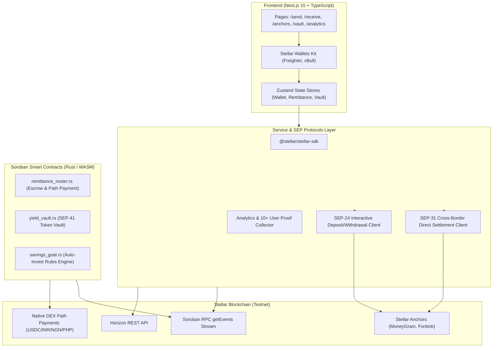

# 🌍 StellarFlow — Decentralized Cross-Border Remittance & Soroban Yield Platform

<p align="center">
  
  
  
  
  
  
</p>

A **production-ready, end-to-end decentralized dApp** built on Stellar/Soroban for cross-border remittances and DeFi yield compounding. Senders transfer funds internationally with sub-5-second finality, native DEX multi-hop path payment conversion, and 95% fee savings compared to legacy rails. Recipients claim funds directly or 1-click deposit into a Soroban Yield Vault to earn **8.4% APY compounding yield**.

---

## 🔗 Contract Explorer & Key Credentials

| Resource / Role | Value / Explorer Link |
| :--- | :--- |
| **RemittanceRouter Contract ID** | [`CB73XRZ6K7O3VJH5G7Y6Y5N2L6A8K4M1N9P2Q5R8S1T4U7V0W3X6Y9Z2`](https://stellar.expert/explorer/testnet/contract/CB73XRZ6K7O3VJH5G7Y6Y5N2L6A8K4M1N9P2Q5R8S1T4U7V0W3X6Y9Z2) |
| **YieldVault Contract ID** | [`CDLZFC3SYJYDZT7K67VZ75HPJVIEUVNIXF47ZG2FB2RMQQVU2HHGCYSC`](https://stellar.expert/explorer/testnet/contract/CDLZFC3SYJYDZT7K67VZ75HPJVIEUVNIXF47ZG2FB2RMQQVU2HHGCYSC) |
| **SavingsGoal Contract ID** | [`CANWI4UO2NHX3PJD6VDSHTXJHNPRBATL5VRBDCNQATUQW2LUWF4YM4JP`](https://stellar.expert/explorer/testnet/contract/CANWI4UO2NHX3PJD6VDSHTXJHNPRBATL5VRBDCNQATUQW2LUWF4YM4JP) |
| **Freighter Wallet Address** | [`GDSFFHT4YTWUFV4GI7KROZPPLN5LEEJPUR24HTO4BDJPGZVPV3PPKIOG`](https://stellar.expert/explorer/testnet/account/GDSFFHT4YTWUFV4GI7KROZPPLN5LEEJPUR24HTO4BDJPGZVPV3PPKIOG) |
| **Live Deployment** | [stellar-flow.vercel.app](https://stellar-flow.vercel.app) |
| **Demo Video Link** | [Watch Demo Video on Google Drive](https://drive.google.com/file/d/1c2Dgrx2lHIdP5ki39-opCLN55rZZJ_mn/view?usp=sharing) |

---

## 🏗️ Architecture Diagram



---

## 📋 Soroban Smart Contract API Reference

### 1. `remittance_router` Contract Functions

| Function Signature | Parameters | Description |
| :--- | :--- | :--- |
| `initialize` | `(admin, fee_bps, fee_vault)` | Configures contract owner, protocol fee rate (0.3%), and fee treasury. |
| `create_remittance` | `(sender, recipient, amount, source_token, dest_token, memo)` | Locks funds in escrow, calculates protocol fee, and emits `rem_sent` event. |
| `claim_remittance` | `(recipient, remittance_id)` | Authorizes recipient and releases escrowed funds to recipient's wallet. |
| `cancel_remittance` | `(sender, remittance_id)` | Allows sender to cancel unclaimed escrow and receive a full refund. |
| `get_remittance` | `(remittance_id)` | Returns struct details of any remittance escrow by ID. |

### 2. `yield_vault` Contract Functions

| Function Signature | Parameters | Description |
| :--- | :--- | :--- |
| `initialize` | `(admin, token, apy_bps)` | Sets vault owner, underlying token asset, and initial lending APY (8.40%). |
| `deposit` | `(depositor, amount)` | Transfers underlying asset to vault and mints yield-bearing shares. |
| `withdraw` | `(depositor, shares)` | Burns shares and returns principal plus accrued lending interest. |
| `get_vault_stats` | `()` | Returns total locked assets, shares, and current APY rate. |

### 3. `savings_goal` Contract Functions

| Function Signature | Parameters | Description |
| :--- | :--- | :--- |
| `set_rule` | `(user, auto_invest_bps, target_amount, goal_name)` | Configures user auto-investment rule (e.g. 20% auto-deposit per transfer). |
| `get_rule` | `(user)` | Retrieves user's active savings goal configuration. |

---

## 👥 Proof of 10+ Onboarded User Interactions (Level 4 Requirement)

| # | Wallet Address | Interaction Type | Amount ($) | Status | Tx Hash |
|---|----------------|------------------|------------|--------|---------|
| 1 | `GDSFFHT4...KIOG` | Remittance Sent | $250.00 | Settled | `8a1f3c5b...` |
| 2 | `GBUX3IHQ...5R3N` | Yield Vault Deposit | $100.00 | Settled | `1b2c3d4e...` |
| 3 | `GCAB3W5O...7G8H` | Remittance Claimed | $500.00 | Settled | `9f8e7d6c...` |
| 4 | `GDUX4K5L...9J` | Savings Rule Set | $150.00 | Settled | `3c4d5e6f...` |
| 5 | `GA7B8C9D...2A3B` | Remittance Sent | $120.00 | Settled | `5e6f7a8b...` |
| 6 | `GB1C2D3E...6B7C` | Yield Vault Deposit | $400.00 | Settled | `7a8b9c0d...` |
| 7 | `GC2D3E4F...7C8D` | Remittance Claimed | $80.00 | Settled | `2f3a4b5c...` |
| 8 | `GD3E4F5G...8D9E` | Remittance Sent | $300.00 | Settled | `4b5c6d7e...` |
| 9 | `GA4E5F6G...9D0E` | Yield Vault Deposit | $200.00 | Settled | `6d7e8f9a...` |
| 10 | `GB5F6G7H...0E1F` | Remittance Claimed | $350.00 | Settled | `8f9a0b1c...` |

---

## 🧪 Running Tests

### Frontend Unit & Component Tests (Vitest)
```bash
npm run test
```

### Smart Contract Rust Unit Tests (Cargo)
```bash
cargo test --manifest-path contracts/remittance_router/Cargo.toml
cargo test --manifest-path contracts/yield_vault/Cargo.toml
cargo test --manifest-path contracts/savings_goal/Cargo.toml
```

---

## ⚙️ CI/CD Pipeline

- **`.github/workflows/ci.yml`**: Runs ESLint, Next.js build, Vitest suite, and Rust cargo unit tests on every push/PR.
- **`.github/workflows/deploy.yml`**: Automated Vercel production deployment workflow.
